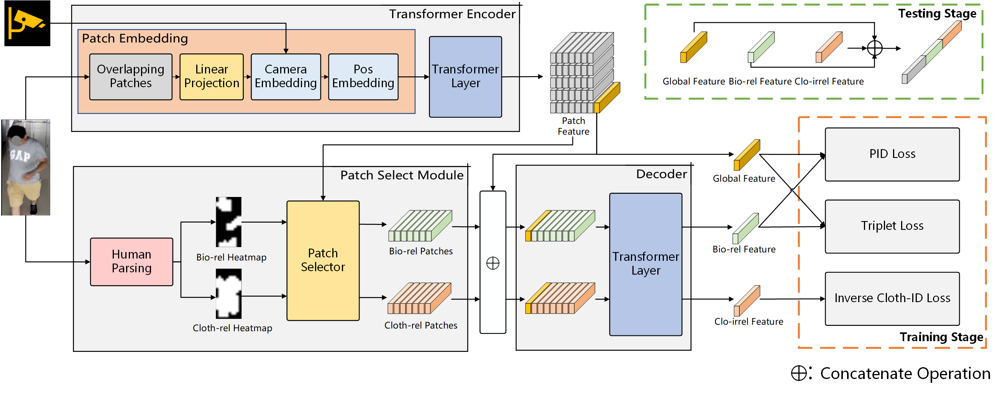

# TCiP
The official code of "A Transformer-based Cloth-irrelevant Patches Feature Extracting Method for Long-Term Cloth-Changing Person Re-identification" (Accepted by CGI 2022)

## Pipeline

## Requirements
### Env
```
python >= 3.7
pytorch >= 1.8
tensorboarx >= 2.5
pyyaml >= 6.0
```

### DATA PREPARE
We use extra human parsing result generated by [SCHP](https://github.com/GoGoDuck912/Self-Correction-Human-Parsing).

1. Install SCHP and download LIP pretrained model(exp-schp-201908261155-lip.pth).
2. Replace "simple_extractor.py" in SCHP with the same name file in our repo.
3. Extract human parsing results following:
```
python simple_extractor.py --model-restore ./exp-schp-201908261155-lip.pth --input-dir ../dataset/market1501/bounding_box_train --output-dir ../dataset/market1501/bounding_box_train-mask

python simple_extractor.py --model-restore ./exp-schp-201908261155-lip.pth --input-dir ../dataset/market1501/bounding_box_test --output-dir ../dataset/market1501/bounding_box_test-mask

python simple_extractor.py --model-restore ./exp-schp-201908261155-lip.pth --input-dir ../dataset/market1501/query --output-dir ../dataset/market1501/query-mask

python simple_extractor.py --dataset atr --model-restore ./exp-schp-201908261155-lip.pth --input-dir ../dataset/MSMT17/bounding_box_test --output-dir ../dataset/MSMT17/bounding_box_test-mask

python simple_extractor.py --dataset atr --model-restore ./exp-schp-201908261155-lip.pth --input-dir ../dataset/MSMT17/query --output-dir ../dataset/MSMT17/query-mask

python simple_extractor.py --dataset atr --model-restore ./exp-schp-201908261155-lip.pth --input-dir ../dataset/MSMT17/bounding_box_train --output-dir ../dataset/MSMT17/bounding_box_train-mask
```

### TRAIN
```python
#train on LTCC
python main.py --cfg ./config/TCIP-ltcc-train.yaml

#train on Market-1501
python main.py --cfg ./config/TCIP-market-train.yaml

#train on MSMT17
python main.py --cfg ./config/TCIP-msmt17-train.yaml
```

### EVALUATION
Download the trained models in following link:
[LTCC](),[Market-1501](),[MSMT17]().
```python
# test on LTCC
python main.py --cfg ./config/TCIP-ltcc-test.yaml
```

## Acknowledgement
Our experiment framework code follows [https://github.com/oliverck/person_reid_develop](https://github.com/oliverck/person_reid_develop).

And we cite TransReID by following [https://github.com/damo-cv/TransReID](https://github.com/damo-cv/TransReID).


